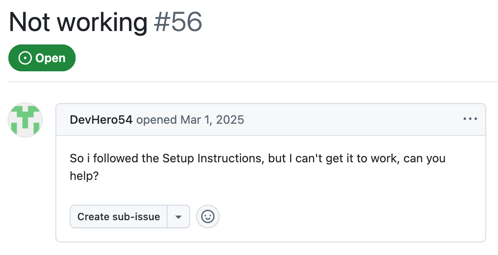
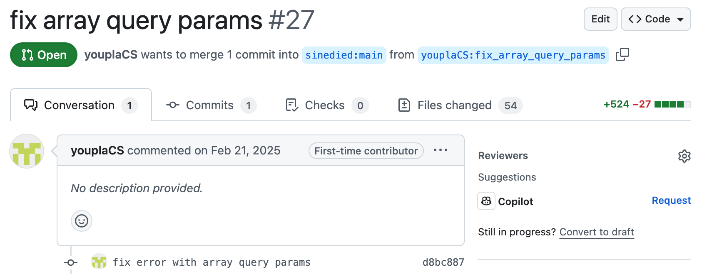

```js
$('#hello').text('DotJS');
```

<!-- 

jQuery once simplified web development by abstracting away complexities—and I think AI needs the same today.

Nearly 20 years ago, jQuery changed the way we build web applications. It made it easier to manipulate the DOM, handle events, and create animations. It was a game-changer, abstracting away the complexities and quirks of cross-browser compatibility, allowing developers like me to focus on what they wanted to achieve. AI needs the same today.

-->

---
title: "jQuery for GenAI"
layout: cover
background: ./images/bg2.png
class: text-center
zoom: 2.3
---

````md magic-move
```js
$`Create an haiku about why JS is awesome`
```

```js
$`Create an haiku about why JS is awesome`

Logic flows like streams,
Dynamic, boundless, it adapts—
JavaScript creates.
```
````

<!-- 
I'm sure you can see something familiar here.
This code here is valid JS that makes use of GenAI.
And you're going to see that it's way more than a simple wrapper for prompts.
-->


---
layout: cover
background: 'linear-gradient(#0000, #0008, #0000), url(images/bg5.png)'
class: text-left
zoom: .99
---

# Prompting is the New Scripting

<Me/>

## {.inline-block .w-15 .m-r-4} Meet GenAIScript{.font-size-8}

<!--
Hey folks, I'm Yohan Lasorsa, and I work as Developer Advocate at Microsoft.
I maintain many open source projects on my free time, and I'm always looking for ways to make it more manageable.
-->


---
title: Issue without context
layout: center
---
{.inline-block .border-rounded-xl}

<!-- 
Answering issues like these to explain that you need some context to be able to help, 
-->

---
title: PR without details
layout: center
---
{.inline-block .border-rounded-xl}

<!--
Or asking for more details about the changes in a PR - takes time. And it's not the really the fun part.

That's how I initially started using GenAIScript.
-->

---
zoom: 1.4
layout: center
# layout: image-left
# image: images/genaiscript.svg
---

{.inline-block .w-20 .m-r-4 .float-left}
# GenAIScript
[aka.ms/genaiscript](https://aka.ms/genaiscript)

<br>

- Use with CLI, VS Code or GitHub Copilot
- Works with GitHub Models, OpenAI, Anthropic, Ollama...
- Supports MCP, vector search, RAG, multi-modal...
- Built-in prompts, tools and agents

<!--
GenAIScript is a JS toolbox for GenAI to help you get more productive with it, allowing you to create even agents to do complex tasks for you, as simple as writing a script. 

It's really meant to be a developer tool and works best when it's used within a project repository.
What I really like about it is that it connects to the latest TODO 
-->


---
layout: image-right
image: https://cover.sli.dev
---

# Code

Use code snippets and get the highlighting directly, and even types hover!

```ts {all|5|7|7-8|10|all} twoslash
// TwoSlash enables TypeScript hover information
// and errors in markdown code blocks
// More at https://shiki.style/packages/twoslash

import { computed, ref } from 'vue'

const count = ref(0)
const doubled = computed(() => count.value * 2)

doubled.value = 2
```

<arrow v-click="[4, 5]" x1="350" y1="310" x2="195" y2="334" color="#953" width="2" arrowSize="1" />


<!-- Footer -->

[Learn more](https://sli.dev/features/line-highlighting)

<!-- Inline style -->
<style>
.footnotes-sep {
  @apply mt-5 opacity-10;
}
.footnotes {
  @apply text-sm opacity-75;
}
.footnote-backref {
  display: none;
}
</style>

<!--
Notes can also sync with clicks

[click] This will be highlighted after the first click

[click] Highlighted with `count = ref(0)`

[click:3] Last click (skip two clicks)
-->

---
level: 2
---

# Shiki Magic Move

Powered by [shiki-magic-move](https://shiki-magic-move.netlify.app/), Slidev supports animations across multiple code snippets.

Add multiple code blocks and wrap them with <code>````md magic-move</code> (four backticks) to enable the magic move. For example:

````md magic-move {lines: true}
```ts {*|2|*}
// step 1
const author = reactive({
  name: 'John Doe',
  books: [
    'Vue 2 - Advanced Guide',
    'Vue 3 - Basic Guide',
    'Vue 4 - The Mystery'
  ]
})
```

```ts {*|1-2|3-4|3-4,8}
// step 2
export default {
  data() {
    return {
      author: {
        name: 'John Doe',
        books: [
          'Vue 2 - Advanced Guide',
          'Vue 3 - Basic Guide',
          'Vue 4 - The Mystery'
        ]
      }
    }
  }
}
```

```ts
// step 3
export default {
  data: () => ({
    author: {
      name: 'John Doe',
      books: [
        'Vue 2 - Advanced Guide',
        'Vue 3 - Basic Guide',
        'Vue 4 - The Mystery'
      ]
    }
  })
}
```

Non-code blocks are ignored.

```vue
<!-- step 4 -->
<script setup>
const author = {
  name: 'John Doe',
  books: [
    'Vue 2 - Advanced Guide',
    'Vue 3 - Basic Guide',
    'Vue 4 - The Mystery'
  ]
}
</script>
```
````

---

# Clicks Animations

You can add `v-click` to elements to add a click animation.

<div v-click>

This shows up when you click the slide:

```html
<div v-click>This shows up when you click the slide.</div>
```

</div>

<br>

<v-click>

The <span v-mark.red="3"><code>v-mark</code> directive</span>
also allows you to add
<span v-mark.circle.orange="4">inline marks</span>
, powered by [Rough Notation](https://roughnotation.com/):

```html
<span v-mark.underline.orange>inline markers</span>
```

</v-click>

<div mt-20 v-click>

[Learn more](https://sli.dev/guide/animations#click-animation)

</div>

---

# Motions

Motion animations are powered by [@vueuse/motion](https://motion.vueuse.org/), triggered by `v-motion` directive.

```html
<div
  v-motion
  :initial="{ x: -80 }"
  :enter="{ x: 0 }"
  :click-3="{ x: 80 }"
  :leave="{ x: 1000 }"
>
  Slidev
</div>
```

<div class="w-60 relative">
  <div class="relative w-40 h-40">
    
    
    
  </div>

  <div
    class="text-5xl absolute top-14 left-40 text-[#2B90B6] -z-1"
    v-motion
    :initial="{ x: -80, opacity: 0}"
    :enter="{ x: 0, opacity: 1, transition: { delay: 2000, duration: 1000 } }">
    Slidev
  </div>
</div>

<!-- vue script setup scripts can be directly used in markdown, and will only affects current page -->
<script setup lang="ts">
const final = {
  x: 0,
  y: 0,
  rotate: 0,
  scale: 1,
  transition: {
    type: 'spring',
    damping: 10,
    stiffness: 20,
    mass: 2
  }
}
</script>

<div
  v-motion
  :initial="{ x:35, y: 30, opacity: 0}"
  :enter="{ y: 0, opacity: 1, transition: { delay: 3500 } }">

[Learn more](https://sli.dev/guide/animations.html#motion)

</div>


---

# Diagrams

You can create diagrams / graphs from textual descriptions, directly in your Markdown.

<div class="grid grid-cols-4 gap-5 pt-4 -mb-6">

```mermaid {scale: 0.5, alt: 'A simple sequence diagram'}
sequenceDiagram
    Alice->John: Hello John, how are you?
    Note over Alice,John: A typical interaction
```

```mermaid {theme: 'neutral', scale: 0.8}
graph TD
B[Text] --> C{Decision}
C -->|One| D[Result 1]
C -->|Two| E[Result 2]
```

```mermaid
mindmap
  root((mindmap))
    Origins
      Long history
      ::icon(fa fa-book)
      Popularisation
        British popular psychology author Tony Buzan
    Research
      On effectiveness<br/>and features
      On Automatic creation
        Uses
            Creative techniques
            Strategic planning
            Argument mapping
    Tools
      Pen and paper
      Mermaid
```

```plantuml {scale: 0.7}
@startuml

package "Some Group" {
  HTTP - [First Component]
  [Another Component]
}

node "Other Groups" {
  FTP - [Second Component]
  [First Component] --> FTP
}

cloud {
  [Example 1]
}

database "MySql" {
  folder "This is my folder" {
    [Folder 3]
  }
  frame "Foo" {
    [Frame 4]
  }
}

[Another Component] --> [Example 1]
[Example 1] --> [Folder 3]
[Folder 3] --> [Frame 4]

@enduml
```

</div>

Learn more: [Mermaid Diagrams](https://sli.dev/features/mermaid) and [PlantUML Diagrams](https://sli.dev/features/plantuml)


